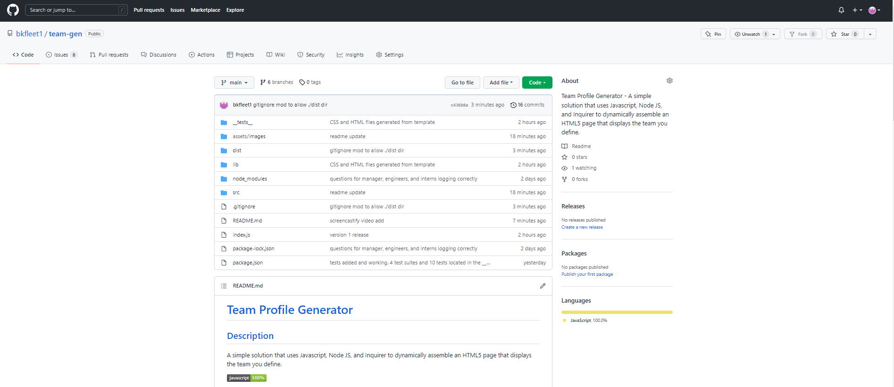
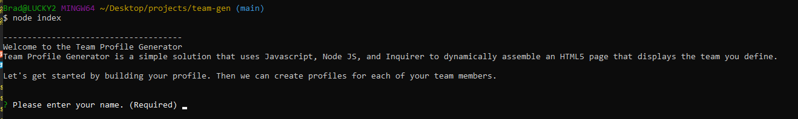
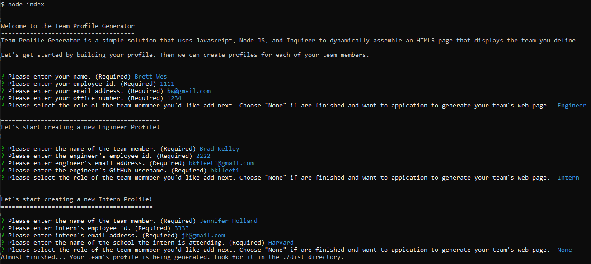
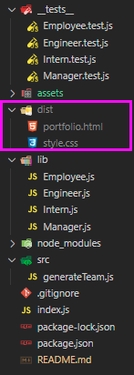
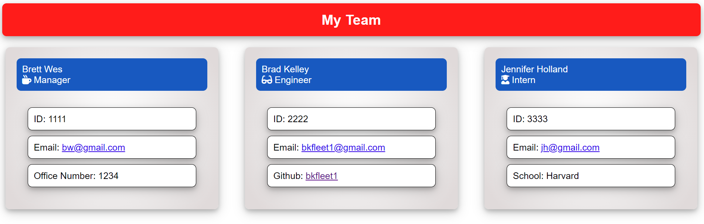
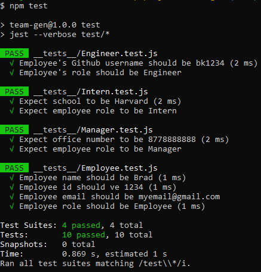

# [Team Profile Generator](#title)

## [Description](#description)
A simple solution that uses Javascript, Node JS, and Inquirer to dynamically assemble an HTML5 page that  displays the team you define.

>> - Project Repository URL: https://github.com/bkfleet1/team-gen

>> - Walkthrough Video: https://watch.screencastify.com/v/GbEjblAJgbtTLYtwQFI0

## Table of Contents
> * [Title](#title)
> * [Description](#description)
> * [Developer](#developer)
> * [Resources](#resources)
> * [Installation](#installation) 
> * [Use Instructions](#usage)
> * [Tests](#tests)
> * [Questions](#questions)

## [Developer](#developer)
[Brad Kelley](mailto:bradkelleytech@gmail.com)

## [Resources](#resources)
The following resources were used in the development of this project.
> * Javascript
> * Node.js
> * NPM
> * Inquire
> * Jest

## [Installation](#installation)
The following steps are required to execute the Team Profile Generator code.

> 1. Clone the repository located at: https://github.com/bkfleet1/team-gen.
> 2. Install Node.js. You can download the latest version of Node.js at https://nodejs.org/en/ ;
> 3. Open the project in a terminal application, such as git bash, and install NPM. To install npm, simply type "npm install" and press enter. Don't close your terminal application, we have a couple more items to install;
> 4. Next install Inquirer, which is a package that enables the question prompts used to populate your readme.md file that will be generated. To install Inquirer simply type "npm i inquirer" and press enter;
> 5. Now we are going to install Jest, which is used to execute text scripts to verify the application's code. You can install Jest by typing "npm i jest" and press enter.

## [Use Instructions](#usage)
After the installation process, you can execute the application. Open the project in a terminal application, such as git bash, and type "node index" and press enter. You should then be presented with a welcome message and prompted for the title of your project, as shown below.

The application will present you with a series of questions designed to build simple personnel profiles, starting with a Manager. Upon completing the Manager profile, you will have the option to create one or more profiles for an Engineer(s) or Intern(s). All staff roles include an Employee Name, ID, Email Address; however, the Manager role includes an Office Number field; the Engineer role includes a Github username field; and the Intern role include a field to record their school of attendance. Once you've defined all of the staff profile, you can simply select 'None' when prompted to add another profile. The image below illustrates this process.
 

Once you've finished defining the staff profiles, the application will generate two files (1. team.html and (2. style.css. You will find these files in the application's ./dist directory.

 

Below is an example of a profile generated by the application.

 

>>>>> *** Note that the application overwrites the content each time you run it. ***

## [Tests](#tests)
The application includes 4 test suites designed to test the creation of the Employee class and three sub-classes that add role-specific fields (Manager, Engineers, and Interns). The Class objects are defined in the ./lib directory and related testing scripts are located in the ./__tests__ directory. To invoke the testing you will need to open a terminal application, such as git bash, and type "npm test" and press enter. The screen capture below illustrates the testing output.

    

## [Questions](#questions)
Please email [Brad Kelley](mailto:bradkelleytech@gmail.com) with any project questions.